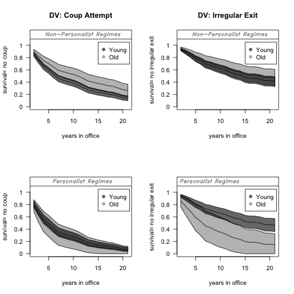
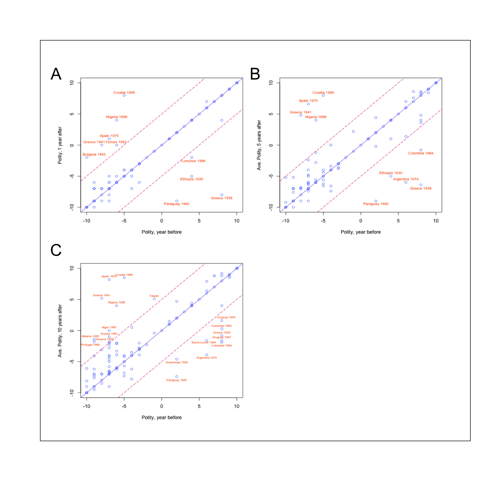
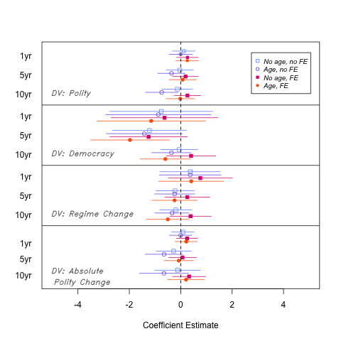
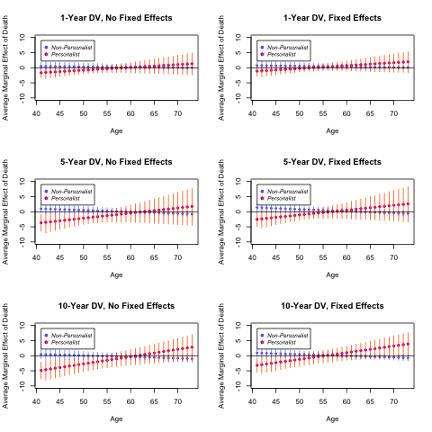
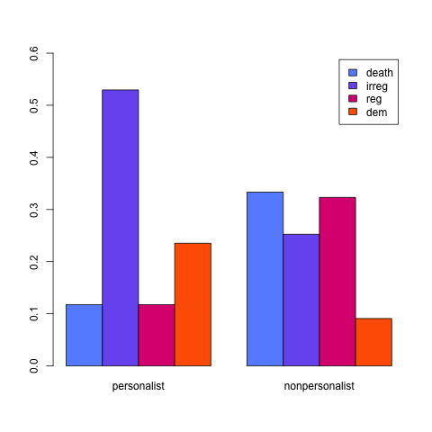
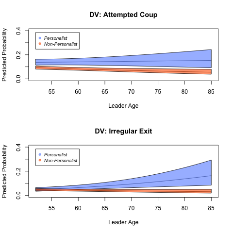
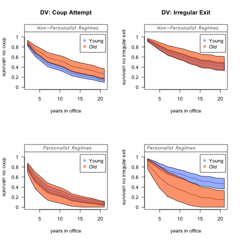
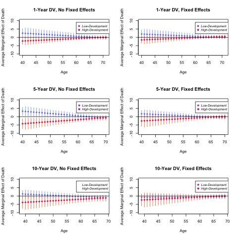
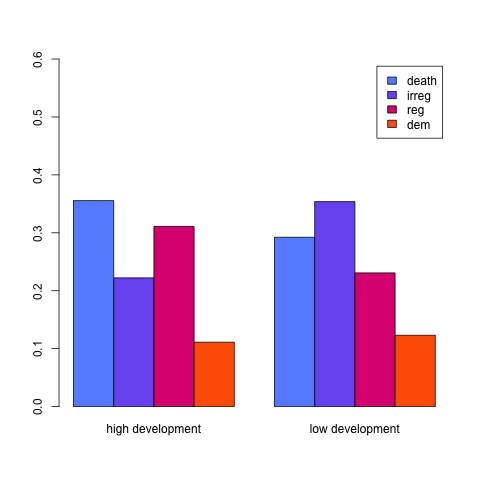

```{r setup, include=FALSE}
knitr::opts_chunk$set(echo = TRUE, fig.align = "center")
```

# Abstract[^1]

|       Hummel (2020) found that leader deaths rarely result in political liberalization; while personalist and older dictators' deaths are more likely to lead to liberalization, such opportunities are nonetheless modest. With replication data and code provided by Professor Hummel through the Harvard Dataverse, I was able to replicate the findings of the original paper (Hummel, 2019). I had trouble replicating Figure 7, due to what I believe to have been a copy-paste error in the replication code. Given the robustness of the many models created in the Appendix of the original paper, I chose to extend the results by adapting the published figures to a multi-color palette. I suspect that the original paper had restrictions on color due to publication standards, so I took the opportunity to beautify the graphs and model results. Additionally, I checked to make sure that the colors I used were able to be distinguished for various different visual impairments.

# Introduction

|       In her original paper, Hummel investigates post-death liberalization in authoritarian regimes. While broadly defined, authoritarian regimes can be considered any regime that is not wholly democratic. Liberalization means that an authoritarian regime democratizes. Post-death liberalization is a specific instance of such democratization when it is propelled by the death of a leader. Former literature shows that post-death liberalization is extremely rare, and much less likely than liberalization after other modes of leader removal (Kendall-Taylor & Frantz, 2016). She then asks the following questions: "What [...] explains the empirical rarity of post-death reform? Are there circumstances that make liberalization possible?" (2020, p. 981).
|       Hummel first shows that leader death does indeed not lead to liberalization in many cases. She uses four different dependent variables to measure liberalization, including Polity (which is a scale that measures authoritarianism/democracy), an indicator for Democracy, an indicator for Regime Change, and Absolute Change in Polity. For each of these, she looks at 1-Year post-death, 5-Years post-death, and 10-Years post-death.
|       Hummel then relies on theories which take into account leader age. On one hand, reformers would be likely to be able to plan for liberalization if the dictator were aged; knowing that an old dictator is likely to die soon, those who are keen on democratization will be more able to make concrete plans which would take advantage of leader transition. On the other hand, regime elites are also able to take advantage of the transition in their own way; because the threat of leader death looms near, they face increased pressure to ensure a smooth transition. Building on existing theories, Hummel hypothesized that liberalization after the death of an old leader is most likely in economically developed regimes (Treisman, 2015), where demand for liberalization would be strong, and in personalist regimes, where there is high uncertainty in succession (Kendall-Taylor & Frantz, 2016). Personalist regimes are those that are built around a single person, commonly resembling a cult of personality.
|       Using linear and logit regression, with and without fixed effects, Hummel creates forty-eight different models, looking at four key dependent variables: Polity, Democracy, Regime Change, and Absolute Change in Polity. All of these models test the assertion that leader death does not generally lead to liberalization. Next, Hummel uses linear regression models to show that as leaders age, the average marginal effect of leader death on liberalization increases. She further develops these models by separating personalist and non-personalist regimes; she finds that the marginal effect of leader death on liberalization increases in personalist regimes, but not in non-personalist regimes. She lastly separates the regimes by high-development and low-development (in terms of the economy); she finds that high-development does not actually increase the likelihood of post-death liberalization in authoritarian regimes.

# Replication Analysis

|       I began with a replication of Figure 1 from Hummel. The figure has three subplots. Each depicts the relationship between the Polity of a country before and after the death of a leader. In each case, the Independent Variable is Polity, the year before the death of a leader. In Plot A, the Dependent Variable is Polity, 1 year after the death; in Plot B, it is Polity, 5 years after the death; and in Plot C, it is Polity, 10 years after the death.

<p>

</p>

|       In these plots, one thing becomes abundantly clear, regardless of a leader's death, most regimes' Polity scores do not change drastically, even when we look at five years and ten years after the leader's death. Specifically, note that most regimes fall in the band around the middle of each plot: these are those regimes which did not experience significant differences (more than 5) in Polity scores. If leader death led to political liberalization, we would expect that most regimes would lie in the upper-left corner; these are regimes that experienced significant increases in Polity scores after a leader's death. However, this is not what we see. Instead, we actually see about an even number of regimes in the top left corner and in the bottom right corner; this means that we see just as many regimes which see significant decreases in Polity scores as regimes which see significant increases in Polity score.
|       I continued with a replication of Figure 2 from Hummel. The figure depicts the coefficient estimates from a total of 48 different models which assess the effect of leader death on political change. The models are primarily in four different categories, based on their dependent variables. The first set of models uses Polity; the second set of models uses Democracy; the third set of models uses Regime Change; and the last set of models uses Absolute Polity Change. Within each set of models, there are three sub-categories. Each of these uses three different time frames: 1-Year Dependent Variable, which compares the dependent variable in year *t* to year *t-2*; 5-Year Dependent Variable, which compares the dependent variable in years *t* through *t+4* to year *t-2*; and a 10-Year Dependent Variable, which compares the dependent variable in years *t* through *t+9* to year *t-2*. Furthermore, within each of these subgroups, there are 4 versions of the model: one without a control for leader age and without fixed effects; one with a control for leader age and without fixed effects; one without a control for leader age and with fixed effects; and one with a control for age and with fixed effects. All models using Polity and Absolute Polity Change were linear models, whereas all models using Democracy and Regime Change were logit models. For the fixed effects linear models, fixed effects included country and year. For the fixed effects logit models, conditional logit models with country fixed effects were used.

<p>

</p>

|       These plots show that, for the most part, the effect of leader's death on political liberalization is insignificant. There is a negative and significant impact on the 5-Year Democracy variable, and in one case with the 10-Year Polity variable. Hummel notes that there is no case in which there is a significantly positive effect on the likelihood of political change. She says, "These results highlight just how unlikely significant political change, particularly in a liberalizing direction, is to follow the death of a dictator" (2020, p. 983). 
|       Next, I replicated Figure 3. In each subplot, the independent variable is age and the dependent variable is the average marginal effect of leader death on Polity. The first row uses the 1-Year Dependent Variable, the second row uses the 5-Year Dependent Variable, and the third row uses the 10-Year Dependent Variable. The models used for the first column include no fixed effects, whereas the models in the second column include fixed effect specifications for country and year. All models are OLS linear regressions, and they all include a control for Polity at year *t-2*. Marginal effects of leader deaths are calculated using the Margins package in R; the average marginal effect is average of the difference between the predicted value in a year with a death of the leader and the predicted value in a year without a death of the leader.

<p>

</p>

|       While all of these model specifications indeed show that the average marginal effect of death on Polity increases as does age, the effect is not large, nor statistically significant (note the overlap of the bars with the line at 0). This provides a good indication that there is support to Hummel's first hypothesis that "political liberalization is more likely to follow death as a dictator ages" (2020, p. 986). However, because the results are not statistically significant, and appear to have a relatively small effect, we cannot say that age alone is a major contributor to political liberalization after the death of a leader.
|       As a result, Figure 4 differentiates between regime type: personalist or non-personalist. The models are nearly identical to those from Figure 3, except for the addition of a triple interaction between death, age, and regime type. Furthermore, these models also include a control for leader age at year *t-1*. The fixed effects are the same as described above for Figure 3.

<p>

</p>

|       These figures support Hummel's second hypothesis that "post-death liberalization is more likely as leaders age in personalist regimes" (2020, p. 986). We can see that in all specifications, as personalist leaders age, the average marginal effect of death increases, whereas the opposite is true in non-personalist regimes. Importantly, the effect is statistically significant in models that use the 5-Year and 10-Year Dependent Variables, which implies that political liberalization likely takes time to occur following the death of a personalist leader; reform is not likely in the year immediately following death.
|       However, Hummel also showed that these events are extremely rare: death only accounts for about 10% of leader exits among personalist dictators. This can be seen in the replication of Figure 5. This shows the proportions of leader exits in personalist and non-personalist regimes which were results of death, irregular exits (such as coups), regular exits (such as term limits or other institutional constrictions), and democratization.

<p>

</p>

|       Unfortunately, even though it appears the best chance at political liberalization comes when aging personalist dictators die, we can see that personalist dictators die at much lower rates than non-personalist dictators. However, the increased number of irregular exits warrants further analysis.
|       In order to investigate the incidence of irregular exits, Hummel then used logit models to predict the probabilities that a leader would face a coup-attempt or an irregular exit as a function of age and regime type. The models include controls for both the Polity at year *t-1* and a lagged count of attempted and successful coups in the last ten years. Here is my replication of Figure 6:

<p>

</p>

|       First, my replication was not identical to the initial plot in terms of layout. Mine is slightly more stretched along the x-axis. Substantially, the graphs are the same. We can see that as dictators age, the gap between the personalist and non-personalist dictators' probabilities increases for both attempted coups and irregular exits more broadly. This shows that personalist dictators are particularly susceptible to preemptive coup attempts, indicating that elites are more likley to take preemptive action.
|       Hummel then plots the survival (as in no coup or irregular exit) probabilities for both personalist and non-personalist regimes, comparing young and old dictators in each. Young and old thresholds are calculated using the 10th and 90th percentiles of dictator ages at death; these end up as 49 and 82, respectively. Using Cox proportional hazard models, she controls for Polity in year *t-1* and the number of coup attempts in the last ten years. In full transparency, I am not knowledgeable about Cox proportional hazard models, but I was able to replicate the results thanks to the code provided by Hummel through the Harvard Dataverse.

<p>

</p>

|       The overlapping of the young and old intervals in the non-personalist regime plots show that age does not have a significant effect on the probability of survival (i.e. being old does not affect the chances that a non-personalist dictator would face an irregular exit, or more specifically, a coup). However, we can see in the bottom right pane that in a personalist regime, there is a significant distinction between young and old dictators. As the number of years in office increases, so too does the gap in survival probability between young and old dictators; this means that as old dictators age, they face a significant increase in chances of being ousted from power in an irregular exit. I had trouble replicating the bottom left plot of this figure, as I believe there had been a copy-paste error in the replication code. I attempted to fix this error by changing the model number in the code, but that also was different than the published figure. The replication above is my best bet at what the code should have been.
|       Next, Hummel hypothesizes that "post-death liberalization is more likely as leaders age in economically developed countries" (p. 987). In order to test this hypothesis, she carries out a similar design which was used to create Figure 4; her results are shown in Figure 8. In this case, however, Hummel differentiates by economic development rather than regime type. Here, she focused on Low Development and High Development Regimes. The thresholds are calculated using the 10th and 90th percentiles of the natural log of GDP per capita; these are 6.53 and 8.67, respectively. All models are OLS linear regressions, and include a triple interaction between age, leader death, and development. Controls are included for Polity at year *t-2* and there are fixed effects specifications for country and year for those models. The average marginal effects are calculated the same as in Figure 4. Here is my replication of Figure 8:

<p>

</p>

|       As Hummel notes, the findings are  modest. Based on the directions of the lines, we can see that in an economically developed authoritarian regime, the deaths of older leaders have more positive marginal effects on liberalization compared to younger leaders. On the other hand, in a low-development regime, the deaths of older leaders actually have more negative marginal effects on liberalization compared to younger leaders. It is also important to note that for the most part, confidence intervals overlap, indicating that most of the results are not statistically significant. On the whole, leader death does not increase the likelihood of post-death liberalization in a highly developed country.
|       Finally, I replicated Figure 9, which shows a bar graph of the proportions of types of removal in regimes with low development and regimes with high development. Like Figure 5, his shows the proportions of leader exits which were results of death, irregular exits (such as coups), regular exits (such as term limits or other institutional constrictions), and democratization.

<p>

</p>

|       We can see that leader death is actually relatively high in proportion to other modes of exit that leaders face in both high development and low development nations. We can also see that in more highly developed regimes, exits through irregular means are less likely than in a less developed regime. This would mean that elites in the nation would be less poised to stage a coup against the leader in a highly developed regime. Thus, in more highly developed regimes, elites would need to use institutional means of replacing the leader in more cases than in a less developed regime.

# Extension

|       Because Hummel's analysis is extremely robust (she did create forty-eight models for just her first part of analysis), there was not much I could do in terms of using different operationalizations of her variables to extend her models. Additionally, her Appendix is highly in-depth and includes 252 models. Due to this depth in modeling, I decided to extend the paper by adapting the black-and-white color scheme to a multi-color palette. Additionally, I made sure to use a color-blind safe palette and followed best data visualization practices for visual impairment (Nichols). The following are all of the visualizations made for my extension.

<p>

</p>

<p>

</p>

<p>

</p>

<p>

</p>

<p>

</p>

<p>

</p>

<p>

</p>

<p>

</p>

<p>

</p>

|       The multi-color palette makes these more graphs more appealing in the technological world, though they may not translate well to black-and-white print, as the paper was originally published in. However, I have made sure that the colors are safe for those with visual impairments. Additionally, in the extension for Figure 2, I decided to use a multitude of different shapes for the different type of model (shown in the legend), so that they are more easily decipherable as well.

# Discussion

|       If I were to propose an extension of the models given that we had more data on these regimes, I would suggest that we control for some more possible confounders; if we were able to collect data on winning coalition and selectorate sizes, we could possibly control for those factors. Similarly, it would be cool to look at small winning coalition regimes versus large winning coalition regimes in addition to the personalist versus non-personalist distinction. By measuring winning coalition, we could perhaps be able to have a more precise way to measure one of our independent variables. While this would likely correlate with the personalist versus non-personalist dichotomy, it would nonetheless be a good check for robustness. However, I doubt this data is available for such a large sample -- winning coalition and selectorate sizes are hard to calculate for even modern regimes, let alone ones from decades ago.
|       Importantly, I was able to replicate all of the figures from Hummel's paper, except for one (Figure 7). Originally, the replication code had the bottom two panes as identical figures. Again, I suspect this was a copy-paste error. I attempted to fix this by replacing the model used for the bottom right pane; while this fixed the mistake of the identical plots, it still does not look like the originally published plot. For this reason, I suspect that I used the wrong model here, as it may have been one of the other 6 models in the replication code.
|       Nonetheless, the replication results still supported the findings from Hummel's paper. We were able to see that post-death liberalization is an extremely rare event. We also learned that there are certain circumstances where the death of a leader may lead to liberalization (though, this is still rare); namely, liberalization after a leader's death can occur when the leader is old and the head of a personalist regime.
|       This can have major impacts for foreign policy, particularly for those countries that want to help promote democracy abroad. It suggests that waiting for a dictator to die is simply not a good option; the chances that the country liberalizes after his death are not high. For future study, it would be beneficial to carry out similar methods used by Hummel, but assessing the marginal effect of other types of leader exit on liberalization. How often do coups lead to liberalization? How often does foreign military intervention lead to liberalization? While these questions have certainly been tackled by other researchers, it would be interesting to see the same methods used by Hummel applied to these topics. Then, it would be beneficial to compare these types of leader exits so that countries could best determine how to promote democracy abroad.

\newpage

# Bibliography

Hummel, Sarah, 2019. "Leader Age, Death, and Political Liberalization in Dictatorships",

|       https://doi.org/10.7910/DVN/OOLBO9, Harvard Dataverse, V1, 

|       UNF:6:Kg+EG6ljhE8198tOsdY5UQ== [fileUNF]

Hummel, Sarah. 2020. “Leader Age, Death, and Political Liberalization in Dictatorships,” *The Journal of*

|       *Politics*, 82(3):  981-995.

Kendall-Taylor, Andrea, and Erica Frantz. 2016. “When Dictators Die,” *Journal of Democracy*, 27(4): 

|       159–71

Nichols, David. “Coloring for Colorblindness,” *David Math Logic*,

|       davidmathlogic.com/colorblind/#%23648FFF-%23785EF0-%23DC267F-%23FE6100-%23FFB000. 

Treisman, Daniel. 2015. “Income, Democracy, and Leader Turnover,” *American Journal of Political Science*,

|       59 (4): 927–42


[^1]: All materials necessary for this replication can be accessed at my [GitHub Repository: https://github.com/dskinnion/52_replication_proj](https://github.com/dskinnion/52_replication_proj). Additionally, my sincerest thanks to Professor Hummel for making her code and data accessible in order to replicate the figures.